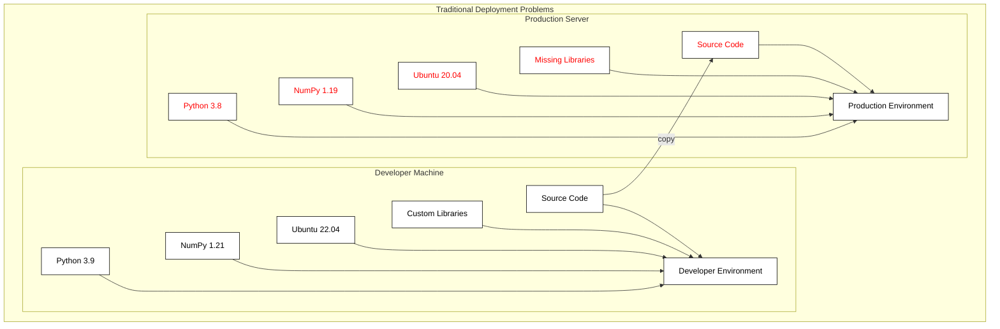
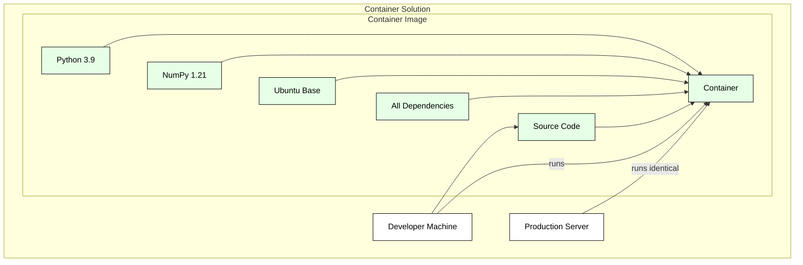
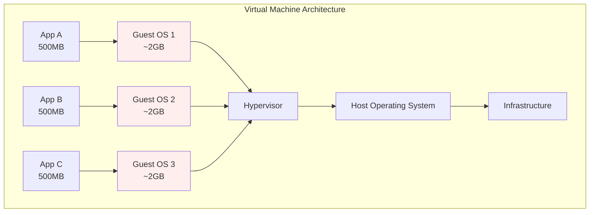
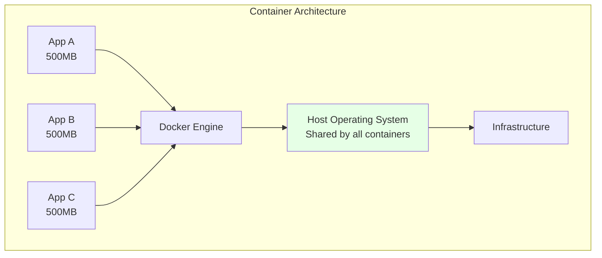
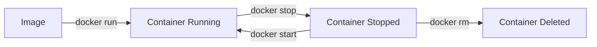
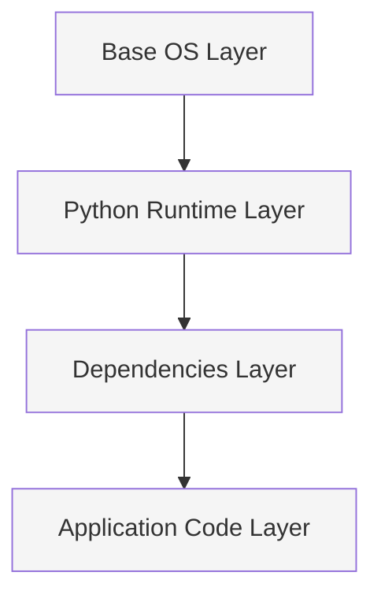
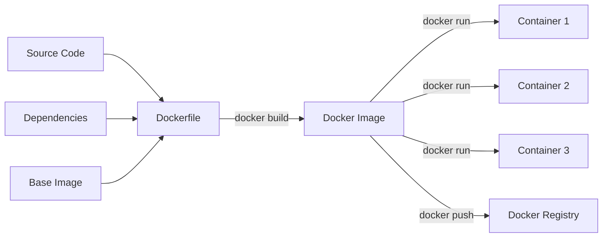

# Docker Tutorial: Introduction to Containerization

## 1. Introduction: Why Containerization?

### The "Works on My Machine" Problem

Every developer has encountered this frustrating scenario: code that runs perfectly on their local machine fails when deployed elsewhere. This problem arises from subtle differences between development and deployment environments:

- Different operating system versions or distributions
- Missing or incorrect versions of dependencies
- Different Python versions
- System-level library inconsistencies
- Environment variables and configuration differences
- File system paths and permissions

This is where containerization comes in. Containers package not just your code, but your entire runtime environment, ensuring that your application runs exactly the same way everywhere.

### Benefits of Containerization

#### Consistency Across Environments
- **Environment Parity**: Development, testing, staging, and production environments are identical
- **Reproducible Builds**: Every container starts from the same base image and follows the same build steps
- **Version Control for Environments**: Your environment configuration is versioned alongside your code
- **No More "Works on My Machine"**: If it works in the container locally, it will work in the container anywhere





The key differences in containerization:
- The entire environment is packaged together
- The same container image runs everywhere
- No environment-specific configuration needed
- All dependencies are included and version-locked

#### Isolation of Dependencies
- **Application Isolation**: Each container runs in its own sandbox, preventing conflicts between applications (mostly)
- **Clean Separation**: Different applications can use different versions of the same dependencies without interference
- **System Independence**: Containers include all necessary system-level dependencies
- **Easy Clean-up**: Removing a containerized application leaves no traces on the host system

#### Easy Deployment and Scaling
- **Portable Deployment Units**: Package everything needed to run your application in a single container image
- **Quick Startup**: Containers start in seconds, much faster than traditional virtual machines
- **Efficient Resource Usage**: Containers share the host OS kernel and use resources more efficiently
- **Horizontal Scaling**: Easily run multiple instances of your application to handle increased load

#### Version Control for Environments
- **Infrastructure as Code**: Your environment configuration is defined in code (Dockerfile)
- **Immutable Infrastructure**: Each container version is immutable and can be reproduced exactly
- **Rollback Capability**: Easy to switch between different versions of your application and its environment
- **Clear History**: Track changes to your environment just like you track changes to your code





Key benefits of the container approach:
1. **Resource Efficiency**: Instead of ~7.5GB (3 apps × 2.5GB each with OS), you might use only ~1.5GB (3 × 500MB) plus one shared OS
2. **Faster Startup**: No need to boot multiple operating systems
3. **Better Resource Utilization**: Memory and CPU are shared more efficiently
4. **Easier Management**: One OS to maintain and update instead of many
5. **Lighter Weight**: Containers are typically megabytes instead of gigabytes

### Real-world Use Cases

#### Web Application Development
- **Scenario**: You're building a web application with Python/Flask and PostgreSQL
- **Problem Without Containers**: 
  - Team members need to install and configure PostgreSQL locally
  - Different OS versions cause subtle bugs
  - New team members spend days setting up their development environment
- **Container Solution**:
  - One Dockerfile for the Flask application
  - One command to start both Flask and PostgreSQL
  - New developers can start coding within minutes
  - Identical setup across all development machines

#### Data Science Projects
- **Scenario**: You're working on a machine learning project with specific library versions
- **Problem Without Containers**:
  - Complex dependencies (TensorFlow, PyTorch, CUDA versions)
  - Code works on your laptop but fails on the training server
  - Jupyter notebook environment differs between team members
- **Container Solution**:
  - Package all ML libraries with exact versions
  - CUDA drivers and GPU support configured once
  - Reproducible Jupyter environments for all team members

#### Automated Testing
- **Scenario**: You want to run tests on every code change
- **Problem Without Containers**:
  - Tests pass locally but fail in CI
  - Test environment gets polluted over time
  - Different Python versions cause inconsistent results
- **Container Solution**:
  - Fresh, clean environment for each test run
  - Exactly same environment in CI and locally
  - Easy parallel testing with multiple containers


## 2. Docker Basics

### What is Docker?
Docker is a platform that enables you to package applications with all their dependencies into standardized units called containers. Think of a container as a lightweight, standalone package that includes everything needed to run your application:
- Your code
- Runtime environment (e.g., Python)
- System tools and libraries
- Configuration files

### Core Components

#### Docker Engine
- The core component that creates and runs containers
- Runs as a background service on your machine
- Handles container management, networking, and storage
- Communicates with Docker CLI through a REST API

#### Docker Desktop
- User-friendly application for Windows, Mac, and Linux
- Includes:
  - Docker Engine
  - Docker CLI
  - Docker Compose
  - GUI for container management
- Handles virtualization automatically on Windows/Mac
- Optional on Linux since Docker runs natively

#### Docker Hub
- Public registry for Docker images
- Like GitHub for containers
- Contains official images for:
  - Programming languages (Python, Node.js, etc.)
  - Databases (PostgreSQL, MongoDB, etc.)
  - Web servers (Nginx, Apache, etc.)
- Allows sharing custom images with team members

#### Docker CLI
Common commands you'll use frequently:

```bash
# Running containers
docker run python:3.9    # Run a Python 3.9 container
docker ps                # List running containers
docker stop <container>  # Stop a container

# Working with images
docker pull python:3.9   # Download an image
docker build -t myapp .  # Build image from Dockerfile
docker images            # List local images

# Container management
docker logs <container>  # View container logs
docker exec -it <container> bash  # Enter a container
docker rm <container>    # Remove a container
```

### Container Lifecycle
1. **Image Creation**
   - Start with a base image (e.g., `python:3.9`)
   - Add your application code
   - Install dependencies
   - Configure environment

2. **Container Runtime**
   - Create container from image
   - Start the container
   - Application runs inside container
   - Container can be stopped/started/restarted



### Key Concepts

#### Images vs Containers
- **Image**: Blueprint for a container
  - Like a Python class definition
  - Read-only template
  - Can be shared and reused
- **Container**: Running instance of an image
  - Like a Python class instance
  - Has its own state
  - Can be started, stopped, deleted

#### Layers
Images are built in layers:

- Each layer represents a change
- Layers are cached and reused
- Makes builds faster and more efficient

## 3. Docker Workflow




### 3.1 Understanding the Docker Ecosystem
- Relationship between:
  - Source code
  - Dockerfile
  - Docker image
  - Docker container
- Image layers and caching
- Docker registries

### 3.2 Your First Docker Project

Let's create a simple Python web application and containerize it. We'll use Flask to create a basic API that returns a greeting message.

#### 1. Create the Project Structure
```bash
mkdir docker-tutorial
cd docker-tutorial
```

Create this file structure:
```bash
docker-tutorial/
├── app.py
├── requirements.txt
└── Dockerfile
```

#### 2. Create the Python Application
```python
from flask import Flask
import socket

app = Flask(__name__)

@app.route('/')
def hello():
    hostname = socket.gethostname()
    return {
        'message': 'Hello from Docker!',
        'hostname': hostname
    }

if __name__ == '__main__':
    app.run(host='0.0.0.0', port=5000)
```

#### 3. Define Dependencies
```text:requirements.txt
flask==3.0.0
```

#### 4. Create the Dockerfile
A Dockerfile is like a recipe that tells Docker how to build your application image. Let's create it step by step:

```dockerfile:Dockerfile
# Use official Python runtime as base image
FROM python:3.9-slim
# 'slim' is a lightweight version of the Python image
# Good for production, contains only essential packages

# Set working directory in container
WORKDIR /app
# Creates and switches to /app directory in container
# Similar to running 'mkdir /app && cd /app'

# Copy requirements file
COPY requirements.txt .
# Copies requirements.txt from your computer to container's /app
# Copy requirements first to leverage Docker's cache system

# Install dependencies
RUN pip install --no-cache-dir -r requirements.txt
# Runs pip install inside the container
# --no-cache-dir reduces image size by not caching pip packages

# Copy application code
COPY app.py .
# Copies your application code to container's /app
# Done after installing requirements to optimize rebuilds

# Make port 5000 available
EXPOSE 5000
# Documents that the container will listen on port 5000
# This is more like documentation, doesn't actually open the port

# Run the application
CMD ["python", "app.py"]
# Command that runs when container starts
# Using array format is preferred over shell format
```

#### 5. Build and Run

Build the Docker image:
```bash
# Create an image named 'my-flask-app' from current directory
docker build -t my-flask-app .
# -t my-flask-app    : Tags the image with name 'my-flask-app'
# .                  : Looks for Dockerfile in current directory
```

You should see output showing each step (called a "layer") being built:
```
[+] Building 12.5s (10/10) FINISHED
 => [internal] load build definition from Dockerfile    0.0s
 => => transferring dockerfile: 37B                     0.0s
 => [internal] load .dockerignore                       0.0s
 ...
```

Run the container:
```bash
# Run the image and create a container
docker run -p 5000:5000 my-flask-app
# -p 5000:5000   : Maps port 5000 on your computer to port 5000 in container
#                  Format is always -p <host-port>:<container-port>
# my-flask-app   : Name of the image to run
```

#### 7. Basic Docker Commands for Development

View running containers:
```bash
docker ps
# Shows all running containers with their:
# - Container ID
# - Image used
# - Command running
# - Created time
# - Status
# - Ports
# - Names

# To see all containers, including stopped ones:
docker ps -a
```

Stop the container:
```bash
docker stop <container_id>
# Gracefully stops the container
# Can use either:
# - First few characters of container ID (e.g., docker stop a12b3)
# - Container name if you specified one
```

View logs:
```bash
docker logs <container_id>
# Shows stdout/stderr from the container
# Useful for debugging

# Follow log output in real-time:
docker logs -f <container_id>

# Show last 100 lines:
docker logs --tail 100 <container_id>
```

Run in detached mode:
```bash
docker run -d -p 5000:5000 my-flask-app
# -d    : Run container in background (detached mode)
#         Terminal remains usable and container runs in background
```

Enter the container:
```bash
docker exec -it <container_id> bash
# exec  : Execute a command in a running container
# -i    : Interactive mode (keep STDIN open)
# -t    : Allocate a pseudo-terminal
# bash  : The command to run (in this case, a bash shell)

# You'll get a shell inside the container:
root@a12b3cd4e5f6:/app#
```

Remove containers and images:
```bash
# Remove a stopped container
docker rm <container_id>

# Remove an image
docker rmi my-flask-app

# Force remove a running container
docker rm -f <container_id>

# Remove all stopped containers
docker container prune
```

#### 8. Making Changes
Let's modify the application to see how changes work:

```python:app.py
@app.route('/')
def hello():
    hostname = socket.gethostname()
    return {
        'message': 'Hello from Docker!',
        'hostname': hostname,
        'version': '1.1'  # Added version
    }
```

Rebuild and run:
```bash
docker build -t my-flask-app .
docker run -d -p 5000:5000 my-flask-app
```

#### Common Issues and Solutions

1. **Port already in use**
```bash
docker ps  # Find running containers
docker stop <container_id>
```

2. **Changes not appearing**
- Make sure you rebuilt the image
- Check you're using the latest image
- Verify the container was restarted

3. **Container exits immediately**
- Check logs: `docker logs <container_id>`
- Ensure CMD is correct in Dockerfile
- Verify app isn't crashing

#### Docker Run Options Reference
Common options for `docker run`:

```bash
# Basic port mapping and detached mode (as seen in demo)
docker run -d -p 5000:5000 my-flask-app

# Give the container a name for easier reference
docker run --name my-api my-flask-app

# Set environment variables
docker run -e DEBUG=1 -e API_KEY=secret my-flask-app

# Mount a volume (sync folder between host and container)
docker run -v $(pwd):/app my-flask-app

# Limit resources
docker run --memory=512m --cpus=0.5 my-flask-app

# Remove container when it exits
docker run --rm my-flask-app

# Override the default command
docker run my-flask-app python -m pytest

# Combine multiple options
docker run -d \
    --name my-api \
    -p 5000:5000 \
    -e DEBUG=1 \
    -v $(pwd):/app \
    --memory=512m \
    my-flask-app
```

Common use cases:
- **Development**: `-v $(pwd):/app` to sync code changes
- **Debugging**: `-e DEBUG=1` to enable debug mode
- **Production**: `--memory=512m --cpus=0.5` to limit resources
- **CI/CD**: `--rm` to clean up after tests

#### Interacting with Running Containers

View container information:
```bash
# Detailed container info
docker inspect <container_id>

# Container resource usage
docker stats <container_id>

# Process list in container
docker top <container_id>
```

File operations:
```bash
# Copy file from container to host
docker cp <container_id>:/app/output.log ./output.log

# Copy file from host to container
docker cp ./config.yml <container_id>:/app/config.yml
```

Execute commands:
```bash
# Run a one-off command
docker exec <container_id> python -c "print('hello')"

# Start an interactive Python shell
docker exec -it <container_id> python

# Check container environment variables
docker exec <container_id> env

# View running processes
docker exec <container_id> ps aux
```

Network debugging:
```bash
# Check container networking
docker exec <container_id> netstat -ln

# Test container DNS
docker exec <container_id> ping another-container

# View container logs with timestamp
docker logs -t <container_id>
```

Container management:
```bash
# Pause/unpause container
docker pause <container_id>
docker unpause <container_id>

# Restart container
docker restart <container_id>

# Update container resources without restart
docker update --memory=1g --cpus=1 <container_id>

# Rename container
docker rename old-name new-name
```

## 4. Advanced Topics

### Working with Volumes
Volumes persist data outside containers. There are two main ways to handle persistent storage:

#### Bind Mounts
Connect a container path directly to a folder on your computer:
```bash
# Syntax: -v /path/on/your/computer:/path/in/container
docker run -v /home/user/project:/app my-flask-app

# Common development setup (using current directory)
docker run -v $(pwd):/app my-flask-app

# Windows example
docker run -v C:\Users\YourName\project:/app my-flask-app
```
The container sees your local files directly. When you change a file on your computer, it changes in the container immediately.

#### Docker Volumes
Create a storage space managed by Docker:
```bash
# Syntax: -v volumename:/path/in/container
docker volume create mydata
docker run -v mydata:/data postgres

# The actual files are managed by Docker and stored in Docker's area
# (usually /var/lib/docker/volumes/ on Linux)
```
You don't directly access these files on your computer - Docker manages them for you.

#### Key Differences
- **Bind Mounts** (`-v /your/path:/container/path`):
  - You choose where files are stored on your computer
  - Great for development (edit code, container sees changes)
  - You can browse the files directly in your file explorer
  - Example: `-v $(pwd):/app` for live code changes
- **Volumes** (`-v volumename:/container/path`):
  - Docker manages the storage location
  - Better for data that only containers need
  - Can't easily browse files in file explorer
  - Example: `-v pgdata:/var/lib/postgresql/data` for database storage

### Docker Networking
Connect containers to communicate with each other. Let's use a common example: a Python web application that needs to connect to a database.

```bash
# Create a network for our application
docker network create mynet
# This creates an isolated network where containers can find each other by name

# Run a PostgreSQL database container
docker run --network mynet --name db postgres
# --network mynet    : Connect to our created network
# --name db         : Give it name 'db' (other containers will use this as hostname)
# postgres          : Official PostgreSQL database image from Docker Hub

# Run our Flask application container
docker run --network mynet --name api my-flask-app
# --network mynet    : Same network as database
# --name api        : Name it 'api' for clarity
# my-flask-app      : Our application image from earlier
```

In this example:
- **PostgreSQL container**: Runs a database server
  - Industry-standard open-source database
  - Stores data persistently
  - Other containers can connect to it using hostname 'db'
  - Default port is 5432

- **Flask container**: Runs our web application
  - Handles HTTP requests
  - Processes business logic
  - Connects to database using hostname 'db'
  - Example connection string: `postgresql://db:5432/mydb`

The containers can now communicate as if they were on the same network, but remain isolated from other containers and the host system.

### Docker Compose Basics
Docker Compose lets you define multi-container applications in a single YAML file called `docker-compose.yml`. Instead of running multiple `docker run` commands, you define your entire application stack in this file.

Example `docker-compose.yml`:
```yaml
services:
  # Our Flask application
  web:
    build: .              # Build using local Dockerfile
    ports:
      - "5000:5000"      # Port mapping like -p 5000:5000
    environment:
      - DEBUG=1          # Environment variables like -e DEBUG=1
    volumes:
      - .:/app          # Volume mapping like -v $(pwd):/app
    depends_on:
      - db              # Ensures db starts first
  
  # PostgreSQL database
  db:
    image: postgres      # Use postgres image from Docker Hub
    environment:
      POSTGRES_PASSWORD: secret
    volumes:
      - pgdata:/var/lib/postgresql/data  # Named volume for database files

volumes:
  pgdata:  # Define named volume for database persistence
```

This replaces these docker commands:
```bash
# Without Docker Compose
docker network create myapp_network
docker run -d \
    --name db \
    --network myapp_network \
    -e POSTGRES_PASSWORD=secret \
    -v pgdata:/var/lib/postgresql/data \
    postgres
docker run -d \
    --name web \
    --network myapp_network \
    -p 5000:5000 \
    -e DEBUG=1 \
    -v $(pwd):/app \
    my-flask-app

# With Docker Compose - just one command:
docker-compose up -d
```


Docker Compose automates the configuration of running the containers, and makes the configuration reproducible, too.
This is especially useful when containers are started and stopped often, for example for:
- Development environments
- Automated testing
- Sharing application stacks with other developers


## 5. Best Practices and Tips

### Dockerfile Optimization
- Use specific base image tags (e.g., `python:3.9-slim` not just `python`)
- Order commands by change frequency (least to most frequent)
- Combine RUN commands with `&&` to reduce layers
- Use `.dockerignore` to exclude unnecessary files
```dockerfile
# Bad
RUN pip install flask
RUN pip install requests
RUN pip install pandas

# Good
RUN pip install flask requests pandas
```

### Security Considerations
- Don't run containers as root
- Never store secrets in images
- Scan images for vulnerabilities
- Keep base images updated
```dockerfile
# Add non-root user
RUN useradd -m myuser
USER myuser

# Use environment variables for secrets
ENV API_KEY=${API_KEY}
```

### Development Workflow Tips

VS Code is really good at supporting development inside a container. This is most efficient with the Dev Containers extension. Below, I'll show you a minimal working example that you can adapt to your needs. However, there are many ways to set this up. For more info, you can check out the VS Code tutorial [here](https://code.visualstudio.com/docs/devcontainers/tutorial) and a tutorial on YouTube [here](https://www.youtube.com/watch?v=6OxqiEeCvMI).

This works in two steps:

- Containerize your code:
    - Create a `Dockerfile` to build an image including source code & dependencies
    - Create a `docker-compose.yml` to specify how to run the development container
- Set up VS Code & the Dev Containers extension to actually run the container

#### Example codebase

Here's a really silly example code base to show how to set up a docker-based development environment. It's a simple Python project with a package, a script, and a test, and relies on an external package (numpy).

```bash
docker-demo-project
├── useful_package/
│   ├── __init__.py  
│   ├── useful_code.py  # Contains function `foo`
├── main.py             # Script to run function `foo`
├── tests/
│   ├── test_useful_code.py  # Contains simple test of `foo`
```

For completeness, here is the content of the files:
```python
# useful_package/__init__.py
from .useful_code import foo
```

```python
# useful_package/useful_code.py
import numpy as np

def foo():
    arr = np.array(['H', 'e', 'l', 'l', 'o', ',', ' ', 'w', 'o', 'r', 'l', 'd', '!'])
    return arr
```

```python
# main.py
from useful_package import foo

print(foo())
```

```python
# tests/test_useful_code.py
import numpy as np
from useful_package import foo

def test_foo():
    actual_list = []
    for char in "Hello, world!":
        actual_list.append(char)
    assert np.array_equal(foo(), np.array(actual_list))
```


#### Setting Up Development Container

1. Add a `requirements.txt` file to your project root:
```
numpy
```

2. Create a `Dockerfile` in your project root:
```dockerfile
FROM python:3.12-slim

WORKDIR /workspace
COPY requirements.txt .
RUN pip install --no-cache-dir -r requirements.txt

# Install development tools -- I like this to be in the dockerfile explicitly, instead of 'hidden' in the requirements.txt
RUN pip install pytest pytest-watch debugpy

# Keep container running for development
CMD ["tail", "-f", "/dev/null"]
```

3. Create a `docker-compose.yml` for development:
```yaml
services:
  dev:
    build: .
    volumes:
      - .:/workspace  # Note that this is a bind mount - changes to files on host are reflected in container (and vice versa)

    # Enable debugging
    ports:
      - "5678:5678"  # for debugpy
```

#### VS Code Integration

1. Install "Dev Containers" extension in VS Code (more on Dev Containers below)
2. Configure the dev container
    1. Click on the 'Open a Remote Window' button (the blue button with vertically shifted > and < symbols) and select 'Add Dev Container Configuration Files' or go to the command palette and run 'Dev Containers: Add Dev Container Configuration Files'
    2. Select 'Add configuration to workspace'
    3. Select 'From 'docker-compose.yml'
    4. Select any Features you want to enable (I don't think you need any) and click 'OK'
    5. Select any optional files/directories to mount (I don't think you need any) and click 'OK'

    This will add a `.devcontainer` folder to your project root with a `devcontainer.json` file, and another `docker-compose.yml` file (don't worry, this builds on the one you already have and doesn't interfere with it).
    You can leave the new `docker-compose.yml` file as is. The `devcontainer.json` file gives you lots of options for customizing the dev container. You could specify VS Code extensions to install, for instance. However, you can also do this later once the container is running. You could consider changing the name of the dev container to something more descriptive (for me, it defaulted to 'Existing Docker Compose (Extend)', which is rather cumbersome).
3. Use the VS Code inside the container
    - Start the container by using the bottom left button or the command palette to 'Reopen in Container' (you are probably already prompted to do this).
    - A new VS Code window will open inside the container (you can see this in the bottom left corner of the window, and in the built-in terminal).
    - Install Python and other extensions you need (most likely you'll also be prompted to install the Python extension). You can set up VS Code as if you had installed it fresh locally. You only need to do this once.
    - You can now use VS Code inside the container. Try running `pytest tests/` on the command line, or running `main.py`.
    - Testing and debugging should also work as expected, including debugging tests.
    - Note that any file changes you make in the container are reflected in the host filesystem, and vice versa.

And this should do it! You should now be able to use VS Code inside the container just like you would locally. Note that this would work even without having installed Python locally!


### Unordered List of Common Pitfalls and Tips

- Not cleaning up unused containers/images
- Ignoring container logs
- Running everything as root
- Using latest tag in production
```bash
# Regular cleanup
docker system prune -a

# Check logs
docker logs -f container_name
```

### Resource Management
- Set memory and CPU limits
- Monitor container resources
- Clean up unused resources regularly
```bash
# Set resource limits
docker run --memory=512m --cpus=0.5 myapp

# Monitor usage
docker stats
```

### Cleanup Strategies
- Remove unused containers and images
- Clean up volumes when no longer needed
- Use automated cleanup in CI/CD
```bash
# Remove all stopped containers
docker container prune

# Remove unused images
docker image prune

# Remove unused volumes
docker volume prune
```


## 7. Advanced topics you might want to look into

- Container orchestration
- CI/CD integration
- Production considerations
- Further learning resources
